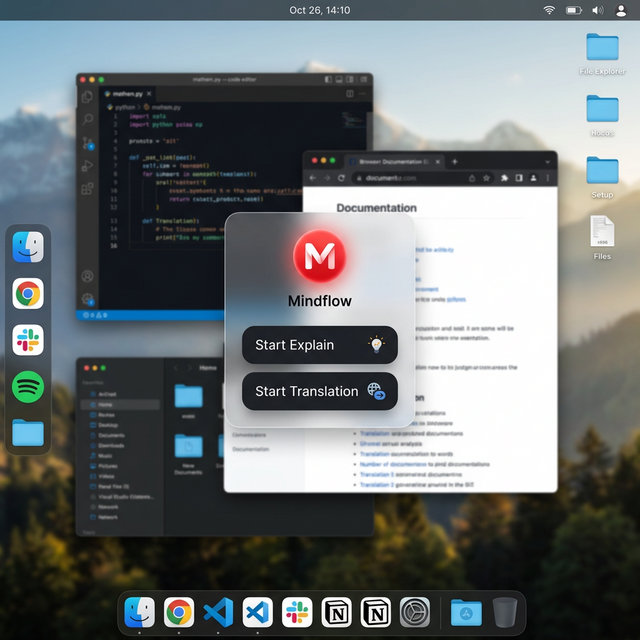

# Floating AI Assistant Architecture

This document describes the module structure and design of the Floating AI Assistant.

## Project Structure
```text
floating-ai-assistant
│
├── README.md
├── requirements.txt
├── main.py
│
├── core
│   ├── llm_service.py     # Handles interaction with the Local LLM models (Ollama)
│   ├── text_extractor.py  # Handles extraction of text from the screen using OCR or Clipboard
│   └── tts_service.py     # Provides Text-to-Speech capabilities
│
├── ui
│   └── floating_widget.py # Contains the PyQt6 logic for the transparent, Draggable UI
│
├── assets
│   ├── demo.gif
│   └── screenshot.png
│
└── docs
    └── architecture.md
```

## Core Components

### 1. User Interface (UI)

- **UI Layer (`ui/floating_widget.py`)**: Built with PyQt6, providing a frameless, transparent widget that stays always on top. It includes custom drag-and-drop mechanics to ensure a smooth desktop experience. The widget operates independently of the services, sending events when buttons are clicked.

### 2. Service Layer
- **Large Language Model Service (`core/llm_service.py`)**: Responsible for handling prompts and sending API requests to the local Ollama instance (`llama3.2:3b`). Contains separate prompt chains for code explanation and general translation.
- **Text Extractor (`core/text_extractor.py`)**: Automates the pressing of `Ctrl+C` via `pyautogui` and reads the target window's content from the clipboard through `pyperclip`.
- **Text-to-Speech (`core/tts_service.py`)**: Utilizes `pyttsx3` to execute non-blocking read-aloud features so the user can listen to explanations without UI freezing.

### Demonstration

The workflow follows a unified cycle:
1. User highlights text and clicks the app UI.
2. App triggers `text_extractor.py`.
3. Extracted text is fed to `llm_service.py`.
4. Output is piped to `tts_service.py`.
